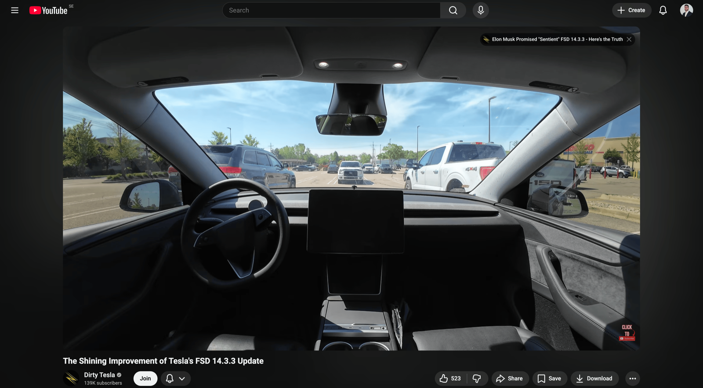
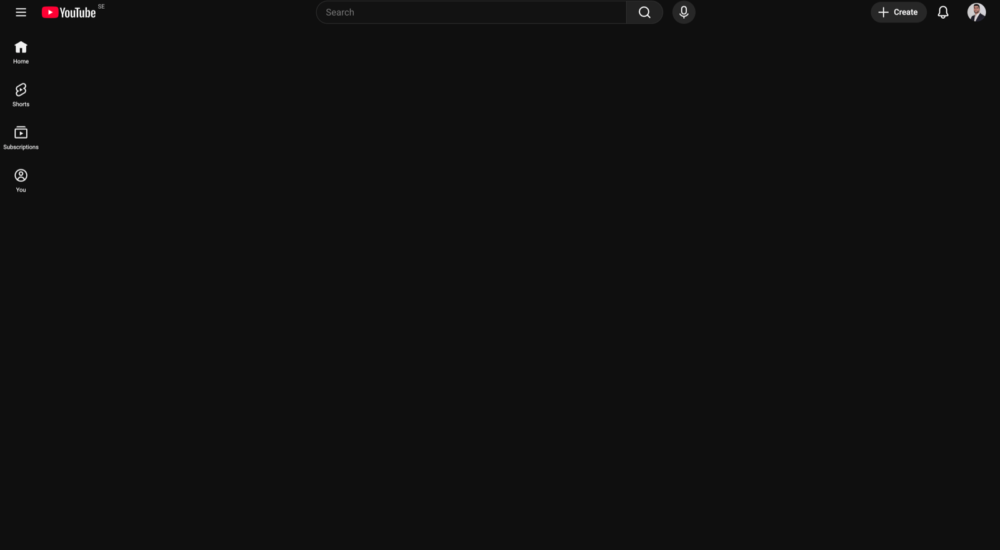

# Youtube Element Remover

A lightweight Chrome extension for hiding distracting YouTube interface elements.

## Current Behavior

- Hides selected items from the YouTube guide/sidebar using CSS.
- Hides recommended videos in the right-side panel on video watch pages.
- Hides front-page video grids, Shorts sections, and topic chips.
- Includes a popup toggle for showing or hiding the distracting elements.

## Preview

### Clean Watch Page

### Clean Home Page

## Local Development

1. Open Chrome and go to `chrome://extensions`.
2. Enable **Developer mode**.
3. Click **Load unpacked**.
4. Select this project folder.
5. Refresh YouTube after making changes.

## Privacy

See [PRIVACY.md](PRIVACY.md).

## Project Structure

- `manifest.json`: Chrome extension manifest.
- `popup.html`, `popup.css`, and `scripts/popup.js`: Extension popup and toggle behavior.
- `scripts/content.js`: Applies the saved toggle state to YouTube pages.
- `styles.css`: CSS injected into YouTube pages.
- `tools/generate-icons.mjs`: Regenerates extension PNG icons from the vector icon style.
